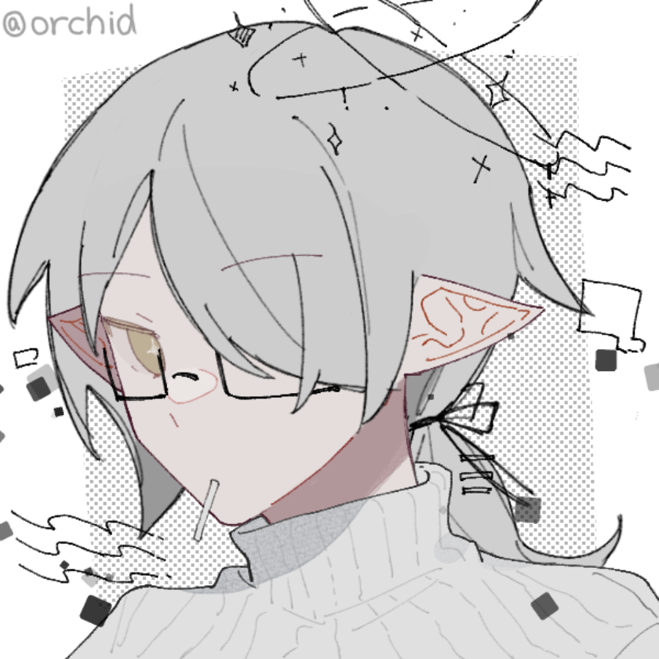
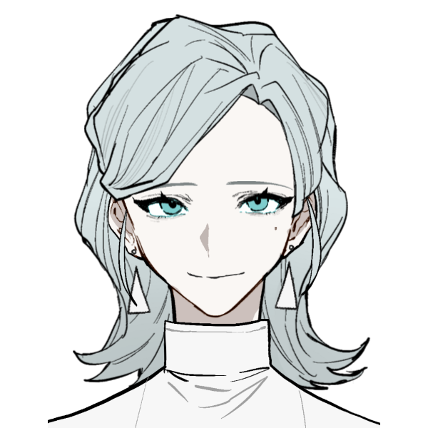

# 一些磕点+脑洞：包含口嗨+梦女
> 原创脑洞，请勿直接拿去就用
> 
> 梦女相关基本上是在坑时的口嗨发言，现在均已全数退坑

## 1
“我其实一直暗恋着你，但是我一直没有做出实际行动，我以为我可以瞒天过海，但其他人其实一直都知道的，后面因为一些原因，让我狠心放下了你，但是在看见你需要帮忙的那一刻，纠结了一下（可能没有）还是决定帮助你，在我看到你的背影时（去追你的对象）还是觉得终究不会是我吧，渐渐的你远离了我，反而经常在不会看到你的地方更频繁的看到你，在你的演出上（别人邀请才知道）才发现许久不见你已经变了好多，结束的时候你跑过来问我为什么一声不吭的跑来看你的演出，在支支吾吾中你喊出一切努力都是想让自己更配得上我，在那一刻我意识到原来你不是在逃避我，在夜晚的河边上，我们互相确定了自己的心意，从那以后，我不再是自己一个人”

*这是吉缘的第一对副cp！可能总结的不好，不过这大概就是自己的个人见解

## 2
“那种兜兜转转终于意识到原来你一直陪伴在我身边，记忆里一直不管怎么样都有你的身影，只是自己一直理所应当的把它（陪伴）当成了一种常态，甚至我的眼里一直有你/你的眼里一直有我，在我终于意识到以后才发现原来你一直陪伴在我身边，一直在等我”

陪伴是最长情的告白

外加一点就是吉缘的第二对副cp黑发那位是真的为了他所爱的人愿意放弃所有的，他没有顾虑就是因为他已经坚定了要一直跟着所爱之人的心

## 3
人挡杀人魔挡杀魔那种大女主，但是对伴侣格外的忠诚和包容，但是还是有理智的那种，在爱人面前乖乖小白兔，一旦威胁到自己或者爱人直接解决掉(不是直接弄死而是软禁起来那种？)

## 4
“在经历了一系列的事情（虐恋情节）以后我终于决定放弃你，在远离你以后的几年里一个人也过的很舒畅，在我以为终于可以忘记/摆脱这一切的时候你的手下突然找上门来，说你病得很重，念着我还欠你一份人情的情况下我叹了口气还是决定最后帮你一把，在一切都尘埃落定以后我拒绝了你的挽留，你告诉我你爱我，但是我已经心如死灰，最后还是拒绝了你，也离开了你，后面的日子过的很舒畅，我实现了自己一个人开个小店的愿望，也偶尔能在听邻里八卦的时候听到你的事情，一切都很平静美好”

*伪be文学（大概）

## 5
我现在好像自己get到一个虐点了，就是目前亚洲同性合法婚姻不是还很少吗，就是那种两人相爱但是碍于都是同性，不管自己有多爱对方也不能在法律意义上是婚姻关系（？）但是我看漫画里有说霓虹那边好像有些地方实施了伴侣制度还是什么

## 6
那种一开始跟男主的关系也不清不楚，两个人也没有特地的点明，就很暧昧那种，后面阴差阳错的转生，没有选择继续和男主纠缠而是装作一个普通学生上学，做了很多前世没有做过的事情（比如说好好上学什么？）然后成为了学霸，直到男主死也没见过他一面，男主还活着的时候只是偶尔在别人嘴里听到他的八卦，不过也没什么情绪波动，最后想了想还是决定去他的葬礼上站在最不起眼的角落看着自己曾经爱慕过的人下葬，然后在赚够钱以后（没办法，是个人都跟钱过不去）找了个慢生活节奏的地方居住，每天悠闲的看着外面美景什么的（或者是可以开个小店）

最好女主还武力值爆棚（？没办法因为前世跟男主混的嘛，转生以后觉得这个很有用的技能不能丢）

## 7
真的没人喜欢be文学吗，就be不一定是虐的像苦大仇深的那种疼痛文学，平平淡淡的be文学我也很想看啊，不过感觉更像是两个人想开了，尊重对方的选择的感觉，也没说不爱，就是都放下了，至少爱过

## 8
感觉我比较吃的cp两人相处方式都有点类似老夫老妻……？就是那种我懂你你懂我，互帮互助，就有点让人感觉不是在谈恋爱而是已婚（？）

## 9
感觉那种男女主双商在线地位又挺高的设定会很香，两个人也不一定是敌对，但是想着法子坑对方的情景很有趣（别说了，你就是想看冤家互打是吧）

## 10
好奇，会有人写那种男女主全篇没有任何恋爱只是单纯的关系很铁的文吗（？）或者是男女主一生中并没有什么交集但是两个人都过的挺好的（？你确定你不是想看两个路人NPC都单身的文吗）

## 11
开始梦女行为，坐在璃月的最高点俯瞰着整个璃月，从忙碌的码头到隐藏在山谷里的丘丘人（？这视力好像有点过于优秀了）看着胡堂主追着七七，行秋依旧捉弄着重云（我真的是重云厨，真的）香菱带着她的锅巴寻找着各种能下饭的食材，坐在几乎跟云并肩的位置，看着底下的璃月人忙碌着，好像一切都是那么美好的感觉

## 12
其实有些剧情里面感觉男二对女主都比男主对女主好，但是终究跟女主在一起的还是男主，这就是主角光环的强大吗？

## 13
特别好奇比如说假设有一篇文里面的恶役是从乡下来的，一个人努力+天生资质进入了皇家学院，在学院中遇到了女主他们一行人，女主和男主是订婚的状态，然后在这设定下展开的一系列故事（话说和以往的设定交换了身份以后感觉为什么要去当恶役呢……？就着恶役自己的努力+先天优势感觉一个人都可以活的自由光大）

嗯，还是感觉如果换了好像就失去了灵魂

## 14
第一人称看多了讲真有点想看第三人称的第一人称，说直白点其实就是想看以路人眼光看主角，想看的种类还蛮多的，可能最好奇的还是那种女主身体里换了个魂以后发生的事情？虽然这样说出来这位路人确实挺有电灯泡/工具人的感觉，不过确实挺好奇的，究竟会怎样去看待和吐槽算是整个人都变了的女主（感觉会挺有趣的）

或者是原本和女主就是比较好的朋友然后就突然某一天变了个样子？但是问她东西她都能答的上来（因为在原著里作者花了很多笔墨写了关于她和原女主的日常剧情，也算是推动剧情的关键要素？）

## 15
突然又想到了个，是恶役+读心的组合（没错我确实好钟爱看恶役的题材）就是一位乡村姑娘进过各种努力和手段进入了皇家学院，然后成为了恶役，说是恶役也不完全是，她总会很好的拿捏轻重，做的也没有那么过，对恶人也是重拳出击的，或者说在她眼里她打压过的人都是背地里干了些什么不太好的事情，但是在外人眼里她就如同恶役一样，其实读心这个能力帮助她了超级多的事情，也能说她有多干净，其实很多不干不净的事情她也干过，不过在她力所能及的范围内尽量的不牵扯任何一个在那事件里算无辜的人

## 16
其实想看很多以第三人称来描述这个故事的第一人称，觉得会很有趣，想知道对外人来说，女主的这些改变到底给他们带来了什么感受

## 17
有那种可能少年去时鲜衣怒马，归时虽然失去了今日这般天真无邪，但是人至少是健健康康的吗？至少想看看大家都能回来的剧情啊，一行人一起欢快的出发，回来时只有一个人的剧情真的看了很多了……想知道如果大家都平平安安的回来的话究竟是会经历什么

## 18
好像感觉是不是剧情看多了基本上后续都能猜到大致走向甚至是预测了在这个剧情的基础上可能会发生的几条线？

## 19
眯眯眼 欢喜冤家

更细一点还可以比如说两人是同一个组织的，正好也是同一个小队的，然后在执行任务中小队分为两波各自包抄然后不料对方还藏了一手，传出去的消息是错误的导致带领的小队陷入了苦战，交战了很久以后实在是撑不住了，队友也走散了，实在不行就找了一个角落藏了起来，身上受的伤和长时间高强度的交战使人精疲力尽，昏昏沉沉中感觉有人靠近了藏身的角落便迫使自己提起精神看看到底是敌是友

然后发现来人是你那个冤家以后放松了警惕，他看着依靠在墙脚虚弱的你以后蹲了下来，由于受的伤比较重所以意识比较模糊你恍惚间好像看到了他发现你慢慢睁开眼以后藏起来的一点担心就忍不住逗他道是不是在担心自己，然后他超级轻的弹了一下你的额头后说道是自己想多了，看你已经稍微打起精神以后照常的“阴阳怪气”了一番，在你意识模糊到要昏睡过去之前感觉他小声的说了一句“辛苦了，接下来就交给我吧”

然后至于怎么认出来的还可以比如说你看到了来人耳边的金色流苏，那个流苏是你亲手编的，是世界上独一无二的一对，打死也不可能认错

然后至于是怎么送出去的比如说就当时和组里的女生们编挂饰什么的最后编多出来的一份，也不知道怎么处理就比较纠结，然后这时候冤家登场了就一把拿走了然后问你想不出解决方案要不就送他好了，就权当是今年的礼物（组里人有每年互相送礼物的习惯什么的）

*然后没想到他居然直接挂在了耳边当做耳饰戴然后一直戴到了现在

LOFTER里有加设定，详见
2021-12-26《一些磕点》19 ———耳饰

## 20
想看先婚后爱文学，女主是商人之女，双商在线文武双全，母亲很早就去世了，父亲又娶了一个继母，继母嫁进来的时候带了一个小一岁的妹妹，过了一段时间以后继母生了一个女娃，几年以后当一切都看似尘埃落定后突然一封信寄到家里，里面写的是要求父亲实施当年的承诺，父亲解释道是当年家里家徒四壁的时候被（未完待续） 
*男主是债主家的儿子（笑死）注：这段注释是很久以后翻到此条的我写的，笑疯了

## 21
茶馆老板，涣名云，坊间传闻给钱便能除去身上的疼痛，不过能持续多久跟交换的物品有关联（不一定只是钱）传闻里还说那老板身体状况并不好。 
实际上是让交易对象喝特定的茶，就可以疼痛转移，但是最长有效期基本上只有一年左右，前提是交易对象必须亲自来到茶馆里喝茶。
*如果年效过了，交易对象还想续的话必须再次亲自来到茶馆

女主名涣，和云先生一样长生不老，她和别人做了交易，从此就像猫一样有了可以在黑暗看的很清楚、身手矫健等能力，但是代价是眼睛时不时会和猫一样只能看到特定的颜色，云先生为此专门研究了一种药可以缓解这个情况，但毕竟这是获得能力的代价，并不能完全根治。 
*涣一般称涣名云为“云先生”或“先生” 
*代价不止一种但是最影响的是这一种

因为契约的原因，云先生身体不太好（其实没有生病，更多的是疼痛）涣负责照顾云先生和开茶馆，有时还会揽下云先生身上的一部分疼痛或者是契约。 
*茶馆有点类似哈尔的移动城堡，在一个很偏远的地方是本馆，用涣名云的话来讲就是“既然大家都分析不出下一个’落脚点‘在哪，那遇到的’客人‘何尝不是一种’缘分‘？”

## 22
巫女，制药，制香，紫色大裙子，黑色眼罩，黑色手套，盘头，淡紫发，头纱，胸前紫色水晶，耳坠 
以前身份女仆长（？） 
会魔法，会制作等身木偶，接受定制

*梦境与魔女？

## 23
突发奇想，那种定位古代的剧或者是漫画不是有时候有药哑的剧情吗，那药哑到底是什么原理呢

## 24

（最开始那个设定的耳饰跟清光的耳饰很像！代了！）■■ 
（还可以代19！）

## 25
水袖， 
女主家里以前是戏家，

## 26
恶魔x天使

## 27
人偶制作师，会操控人偶，人偶可以作为灵魂的容器，致力于做出耐用的人偶模

## 28
“你是我朝夕相伴，触手可及的虚拟”

## 29
失忆少女，困在梦境中

## 30
巫女，制药，制香，紫色大裙子，黑色手套，盘头，淡紫发，头纱，胸前紫色水晶，耳坠 
以前身份女仆长（？） 
会魔法，会制作等身木偶，接受定制

人偶制作师，会操控人偶，人偶可以作为灵魂的容器，致力于做出耐用的人偶模

拥有顶尖人偶工艺的人的女仆，在那位去世以后在别处人迹稀少的地方建了一个小屋，平时靠接委托为生。

一般是

人偶由于制造过程过于繁琐 
以及需要使用很多稀缺材料 
她很少接制作人偶的委托

一般大家都称呼她“小姐” 
她一般称呼那位为“大人” 
有时也会以“那位”来代表 
（澐）

溟，那位的最后一个人偶 
在那位留给溟的遗嘱下 
来到了她的小屋 
目前还是“半成品”

木偶是没有灵魂的 
一般由拥有者操控

人偶是有灵魂的 
除了身体特殊以外 
但是跟人类的差距还是很大 
*那位可以做出跟人类几乎差不多的人偶

## 31
狐狸道士重云问路 
路人结局

「听着《失眠宇宙》刷到狐狸道士后有感而发，可能有点ooc，请见谅」

“咳咳，那个……打扰一下” 
我盯着眼前的道士，他头上的狐狸耳朵因为害羞而不自在的向后贴在脑袋上。 
“请问小姐，去这里的路怎么走？” 
他说着便递出一张地图，手习惯性地绕了饶头。 
在我详细地圈出沿途的路标以后，我抬头看着他。 
“请问这位道士如何称呼？” 
“我名重云……” 
2022-02-23 20:54:02

## 32
修复时空混乱 
打工人

## 33
*带入一些厂牌007城的世界观 
女主是被捡回去做人体实验的 
所谓的人体实验就是注射流体进血液 
*阿尔卡纳的那种流体的感觉 
慢慢融合以后可以操控流体 
流体黑色的，有自我意识 
一般女主称祂为影 
女主本身不会太表现情感 
就没有被植入芯片 
一次性注射过多流体身体会撑不住

## 34
你是那无悲无喜的神，端坐于云端。

人世间的三千烦恼，不染分毫。

世人与你，不过只是身边的尘埃，与你有了一瞬的接触。

而你分毫不染，依旧无悲，任旧无喜。

——番茄

## 35
双手戴手套，只有手持手杖的时候才会拿下来 
整体穿衣风格偏黑白灰，黑色偏多 
右眼戴着眼罩，双瞳都是白灰色

## 36
村里的巫女 
相传对视上以后会被诅咒 
出门时需要带上面具 
那个时候看不见任何东西 
需要有别人帮忙

看不见，但是对四周有超强的感知 
负责照顾巫女 
时间长以后明白村里相传的一些事情都是谎言 
巫女也只不过是被众人吹捧成众神 
实际上也只是一个平稳众心的工具

## 37
即使被关起来还是给小孩子讲故事（？）的鬼

## 38
姐妹情深 
蓝底的是宝的

## 39
探险家

## 40
月老（？） 
可以自由的操纵红线（物理意义上的

## 41
“我要当医生” “我要成为女明星” “我要做发明”童言中充满小孩子们天真的幻想。 
“真是伟大的梦想，对吧。” 我扭头朝着他说道。 
“是幼稚。” 他毫不留情。 
“金钱和欲望永远不缺，人类的欲望永远也填不满。” 
"也许呢。"我反驳道 
他沉默了一会， 
"......那应该就是万里无一的奇迹吧。" 
——番茄

## 42
星露谷的oc

## 43
"我想成为一名医生，可以拯救很多很多人。" "我想成为一名电影演员，因为她们好漂亮。" "我想发明机器人，就像动漫里的那样"。孩子们的话语中充满了孩子们特有的纯真和稚气。 
"都是些伟大的梦想，不是吗？" 我把头转向旁边的男人说。 
"这很幼稚。" 他毫不留情，孩子就像温室里的一朵花，没有园丁的精心培育和遭受一点点的风雨就会枯萎，死亡。 
"金钱和利益的战场哪里都不缺，人类的贪婪永远无法填满。" 人是自私自利的，他们会为了自己做出一切不可能的事。 
" 也许呢，" 我不以为然地反驳道， 
他沉默了一会儿， 
"......那将是万里无一的奇迹。" 
——番茄

## 44
咒术的oc（暂定） 
很少说话，根据本人所言，说是要“养嗓子” 
说话中只有她想告诉的人可以听见 
别人只能看到她在动嘴巴 
讲话比较快，为了以防有心之人读唇语 
不会腹语，但是感觉快了 
术式是可以在任何人都不知道的情况下伤害转移，具体多少根据本人来定 
*其实是狗卷棘梦女oc 
是异瞳

## 45
明星/演员 
拍摄结束以后急急忙忙赶来找你 
衣服也没有来得及换 
你趁机拉着他拍下了照片

## 46
人偶 
可以考虑是澐制作出来的人偶 
也可以考虑是被制作出来的人偶

## 47
原神oc的小时候（暂定） 
第一张是在坎瑞亚事件时期的情况 
后面几张是小时候师兄给她拍的照 
小时候真的是非常可爱的一个孩子

## 48
琥珀/石珀修炼出来的精灵型 
脖子上有一层浅浅的标识 
有时候为了显得自己比较正式会戴一个领子 
如果想去街上走一走的话会拿脖饰藏起来 
发色是偏琥珀色，一般会穿浅绿色的衣服 
可以代11，或者单独作为一个oc

## 49
宝的原神石珀oc 
原灵感大概是石珀裂开的时候 
和48是好姐妹~

## 50

## 51

## 52
接37的脑洞，是人族小女孩 
家里世代是专门驱鬼的阴阳师 
和哥哥姐姐一起学习祭祀占卜 
好奇心很重，是个天真善良的孩子 
两侧的辫子实在遇到37以后特地留下来的 
*37是被她家族抓回来的所以有心理阴影 
*家训说除非特殊情况，必须随时戴着耳饰

## 53
女皇帝，一直隐瞒着自己是女人的事实，从小时候开始就被当做是男孩子养着，有两个一起长大的青梅们，青梅们扶持皇帝稳住位置，也隐瞒着秘密。 
一位是皇后，一位是贵妃。 
复仇虐文

## 54
从宅子中逃出来的小少爷，在被流浪过程中被蹉跎之时，遇到了一个比好人还好人的人-亚瑟，就像书里描写那位的伟大的王者亚瑟王一样，勇敢，果断，谦卑，怜悯，诚实，公正。他想静静地看着那个人，但他总是在光芒到来前躲闪，就像一辈子没有见过光的人，所以不知道耀眼的光芒会不会灼烧到自己一样。他仿佛看到了什么不可思议的东西，“为什么，为什么有这样的人？” 他疑惑不解。他在流浪的路上，遇见了各色肮脏，污浊的人。有的外表一副很爱妻子的表现，但他一眼就可以看出他是在家暴妻子，对她实施精神控制；有的学生看起来阴郁，瘦弱，但他为了私欲虐待动物，还拍下视频放在网上泄愤。他很疑惑，为什么其他人都像笨蛋一样，明明这么明显的线索，和那副皮囊也掩盖不了的恶意。 
但是亚瑟他不是，亚瑟没有在看到他的时候露出那种低俗恶心的眼神，那双明亮金黄的眼眸里满满的都是真诚，担忧。一眼，就可以让人充满好感。他理解我，他包容我。他像个迟来的家长，充当了他父母的身份，耐性呵护，温柔引导。他渐渐沦陷在这金灿灿的陷阱里，永远都不想出来和醒来。他成功的迈出了第一步，他跟着亚瑟回到了他们的家。“我要叫梅林！”现在正式改名叫梅林的小孩无所畏惧的在地上打滚，拥有了无论如何都会包容他的家长，掩藏许久的小孩子气顿时就泄露了出来。终于，梅林找到了他的线，一根看上去虽然很脆弱的线，但充满了温暖的力量，一直一直的陪伴在他的身边。 
——番茄

## 55
横滨河流管理部部长妹 
人肉垃圾太宰治 
——番茄

## 56
在遇到亚瑟之前，梅林还是个在流浪的小孩。“大叔，你为什么还要笑呢，你不是都在想杀死那个女士了吗？” 梅林不解人们之间的相互欺骗，却又令人惊奇地不受到任何伤害，甚至于就好像没有察觉到彼此在欺骗似的，明明一眼就可以看出他们在撒谎，还有那具躯壳都掩盖不了的恶意。“你。。。你在说什么？”男人很慌张，胖胖的身子一抖一抖的，配上那滑稽的表情让人不自觉的想笑。“哼，烦人的臭小鬼，你家长呢！让她来道歉！”男人震怒的发抖，看着一个毛头小子也敢招惹他，直接上前抓住他的手，狰狞和带着蔑视的表情让梅林心里泛起一阵恶心。梅林不由的想笑出声，看看，这就是所谓的大人，罪恶，阴暗，就像这个世间一样的污浊。“明明就是因为那个女士出轨，让你觉得在朋友面前丢脸，所以你才想杀她的。” 梅林没有丝毫的恐惧，这世间的人们对同类的恶意，才是真正让他发笑的。在旁边的女人本来看笑话的神色一僵，她死死的盯着那个小孩绿色的眼睛，只觉得他的眼睛里没有一丝感情，淡漠，冰冷的像一位高高在上的神明，人类的吵闹，在他眼里不过只是场闹剧，一眼就可以看穿人心底最为不堪的秘密。女人的心里附上一层冷意，仿佛置身在冬天，她控制不住身体的本能，恐惧的躲避着。男人看到女人转头就走，还有围观过来看热闹的人群，面子也挂不住，也不由得放开了手，向女人的方向跑去。围观的人们顿感无趣，慢慢的走开了。骗人的男人，看戏的观众，他们无一不在想梅林揭露人类最阴暗的部分。欺骗，谎言，路人那高高在上的蔑视，都在让梅林对人类妄想的底线慢慢的打破。他因此感到恐惧，可笑，可悲，但如果这就是人类，他还有什么意义生存在这个世间呢。。。 
——番茄

## 57
*流浪小猫在特别幼小的时候被社长看见了呗带去医院治疗，喵喵表示白捡的铲屎官

## 58

## 59
囚禁在高塔里的魔族少女 
其实是深睡多年的深海大妖 
追溯到远古老巢本是一座海底神殿直至数百年前才渐渐升起 
大佬重回新手村 
是(魔修)宗门广场下的一条地道 
身份不明的美少女遇见了命定之人(？)周身封印解除掉落在命定之人怀里？ 
反正是剿灭队伍里的人然后感受到召唤就上前去抱人了

## 60
囚禁在高塔里的魔族少女
其实是深睡多年的深海大妖
”我“是高塔的主人(栖)
是那位把魔族少女关起来的人
曾经侍奉过魔族少女
有一个水史莱姆(煋-Scarlet?)
一般跑腿都靠她
附身在木偶身上
认识澐
两个人是很好的朋友
沉睡的几百年来一直都是栖一个人照顾
魔女也认识澐
煋是近五十年才认识的
煋一般只会用“栖”来称呼栖
基本上不会用“她”
会长从很小就认识栖了
两个人有点算是互相扶持的
有时候栖做的事情会长睁一只眼闭一只眼的就过去了
栖很少跟人交集

(这个是两人曾经的合影，右边的是栖，当时两人在扮演双生子)

## 61
想写个小吸血鬼&ta的移动血库的短篇 
吸血鬼跟他的鸡腿子 
可爱的豪门小少爷（伊恩）ian 
来自中国古武世家大家族的旁支系的二儿子 
因为家里已经有了继承人就被送来当保镖 
和家里人关系都挺好的 
从小就有点腹黑 
长大后脖子上的绷带是为了女票留的 
因为对象是吸血鬼所以这里=私密(绝对)领域 
只能给女朋友看或者摸 
还夹带点纹身 
是个狠角色(主要是用来保护女票)

女主也是贵族大小姐（伊维特）yvette.garcia加西亚/珈茜娅 
吸血鬼吸血的时候可以传递感情，但是身为名门贵族，女主从小就被要求+训练吸血的时候不流露出任何感情

## 62
我突然觉得，某对水仙也挺香的(?) 
早期纯良容易受骗大美人，后期可能腹黑大帅哥 
——海

## 63
墟雾狐狐（是长大后的样子）

## 64
学生时代的狐狐 
后面的女生是狐狐的朋友（你）景源？ 
性格更像男孩子一点 
脸皮厚，喜欢挑逗墟雾 
比较粘人，皮的时候容易浪过头 
经常贴着药膏绑着绷带上学 
（不是特别严重的伤）

## 65
咒术女主 
脑力派 
怼悟也不慌 
虽然嘴上动不动就是拿悟的学生来“威胁”他 
但是也没有真正行动过

## 66
灯火 
时间线在咒术0开始 
栢浅雾江 
有六眼，一直瞒着所有人 
术式是跟雾有关的，虚幻的幻影 
在雾中会有一个分身，适合暗杀 
雾可以迷惑敌人，也可以治疗友方 
没去过学校，一直都是家里请私教

雾江身世： 
母亲是栢浅家的女儿 
栢浅家是横滨的黑手党 
父亲是五条家的旁支 
因为没有咒力不被待见 
不甘心当下，选择逃离五条家白手起家 
然后改名换姓，从东京跑去横滨做了黑手党

*特级咒术师

六眼： 
可以看穿一切咒力的流动与周身信息 
360度远距离视觉，背后也能看到，隔着很远也能看到。 
直接分辨对方是否为术师。 
看穿对方的术式。 
可以对咒力轨迹进行直接追踪/预测。 
可以让持有者进行精细的咒力操作。（使用无下限术式的前置要求） 
阻挡视线也不会妨碍视觉。

根据官方的说法，无下限术式的原理是：把阿基里斯“永远追不到乌龟的悖论”带到现实。换而言之，无下限术式就是现实中的“相对静止”，是靠近的物体会越来越慢，最后永远都碰不到发动者

好心的俄罗斯人+倒霉直男+彭格列雾守（无中生有，有中生无，以此迷惑敌人，使之无法抓住家族成员的实体，虚幻的幻影）

*废案： 
高中毕业以后认识了乌鸦（知道雾江有六眼） 
（代号，目前不知道真名） 
因为经常变成乌鸦到雾江身边 
（术式，没见过本人） 
就被雾江“乌鸦”“乌鸦”的叫了 
本人好像也不反感（？ 
乌鸦算半个情报贩子 
一般是乌鸦和高层联系然后转告给雾江 
有点类似传话筒（？半个高层的人 
雾江回国以后一直没有明面表露出来和五条悟认识 
很长时间五条悟并没有想起来（认识雾江这件事 
雾江很喜欢揉乌鸦（据本人说手感很好 
乌鸦是从东京咒术高专毕业以后出的国

## 67
“镜中人” 
可以透过一切反射的物品去寻找偷窥或者监视某个人某样物品 
穿梭在“镜子”里的“泄密者”(？) 
就是但凡在符合条件的“镜子”的照射范围内，就没有她不能看到或者去到的地方 
本体可能有意的隐藏自己并且不发动能力 
可以躲进镜子里居住 
可能是小时候被迫做过实验(？) 
这是能力异变而诞生的空间 
但是通过能力异变逃出来了

## 68
穗月 
名字是因为出生在秋天 
麦子刚好成熟

“她曾说，入秋后，最喜欢那片山上的枫叶。” 
“秋风吹起来，山上的枫叶就快红了，你，看得到的吧。” 
be文 
cr：顾蓝

## 69
“现在，我们是共犯了。” 
“怪盗小姐”x侦探 
*可以考虑带进68里+64 
ありふれて花束 
Don't Stop the Clocks 
景源x墟雾 
景源主业是颜料+花店的 
副业是“怪盗”，闲下来的时候会接一点委托 
周末一般会去自家花园泡点花茶喝 
或者是去做做委托 
夜视很好，但在强光下基本上看不见 
*正常白天还是能看到东西的，就稍微有点弱视 
墟雾主业是侦探社的侦探，周围的大家都知道他 
因为破案效率快，正确率高，大家都很想找他帮忙 
副业是当匿名情报探子，代号D

## 70
装作普通狐的魔兽x装作普通人的不死魔女 
年上，bg 
或者偶尔GB也不是不可以（反正我不介意） 
大直球狐x佛系魔女 
养成文？ 
银黑狐 
赤狐的基因突变 
顾清昭，许亦(？)

灯塔魔女，会随着时间老去，然后再变成刚出生的样子（但是魔法不受影响）很久之前大家因为黑户的这种特殊的毛发就开始捕猎它们，魔女受到委托去救下这些狐狐，跟赤狐和银黑狐族有点交情，但是也就基本上仅限族里经历过那件事的人 
银黑狐族，赤狐族的一个小分支，人很少，但大家没有视为灾星，而是将他们保护起来，黑狐是因为想体验“普通”生活所以偷偷跑出来，结果发现自己啥也不会，魔力也基本上用光了，然后被镇子上的人捡到了，送给了魔女，一开始以为自己会被做实验（他俩能力不相上下的那种）然后没想到她只是在悠闲的过着普通人的生活，所以他也决定不自爆，就当个普通的狐狸，过养老人生 
*他俩是那种看破不说破的，狐狐以为自己没被她看破，实际上她第一眼就知道不是一般的狐狐了，魔女是瞒都没想瞒狐狐，就正常的在家用魔法

## 71
莉维，灯塔魔女，会真的随着年龄老去，然后“死亡” 
会记得所有的事情，“重生”时可以自由选择年龄段

心海，Tokimeki

使魔，暂时没有跟莉维契约

“悲剧不会打好招呼，带上礼物登门拜访，它只会狠狠闯进来。”

## 72
44+66的融合 
咒术的oc 
100%带梦女的oc 
栢浅雾江

很少说话，心里吐槽倒是一大堆 
术式是可以在任何人都不知道的情况下伤害转移，正逆都可以，具体多少根据本人来定，自身愈合速度很快，所以不是特别重的伤的话可以毫无痕迹的愈合，转移的伤害会愈合的相对慢一点，其还有一种功能是将目标像灯塔水母一样进行“轮回”，正逆都可以，但是其中一方要付出代价（没有规定代价是什么，大部分情况是由发动者选择） 
说话声音比较小，但是只要是她想告诉的人都可以听见
外表看起来比较冷淡，实际上人是很佛系的 
在体术方面不是很擅长，但是拼咒力的话能拿满分 
虽说不会腹语，但是感觉快了（毕竟平常讲话的方式有点类似

## 73
从其它地方来的，目前居住在村子里，经常帮着医生打打下手，对草药稍微熟悉一点，看得到“虫”但是从来也不会说，也不招“虫”，反而有她在的时候“虫”比较少一点（一个比较特别的体质） 
耳饰是可以打开的，经常里面会塞一点急救的药，曾经和以前的虫师学过一点，会制作驱虫的那个“烟”，因为本身就不是很招虫，所以不会抽，只是当类似香薰来点着 
刚来的时候银古还没有回来，所以并不认识他 
雾江景源 
雾江家几年前在村子里安顿了一个家，景源是这次来拜访的，然后暂时就在这里住下了，算半个虫师

## 74
## 75
## 76
## 77
## 78
## 79

## 80
## 81
## 82
## 83
## 84
## 85
## 86
## 87
## 88
## 89

## 90
## 91
## 92
## 93
## 94
## 95
## 96
## 97
## 98
## 99

## 100
## 101
## 102
## 103
## 104
## 105
## 106
## 107
## 108
## 109

## 110