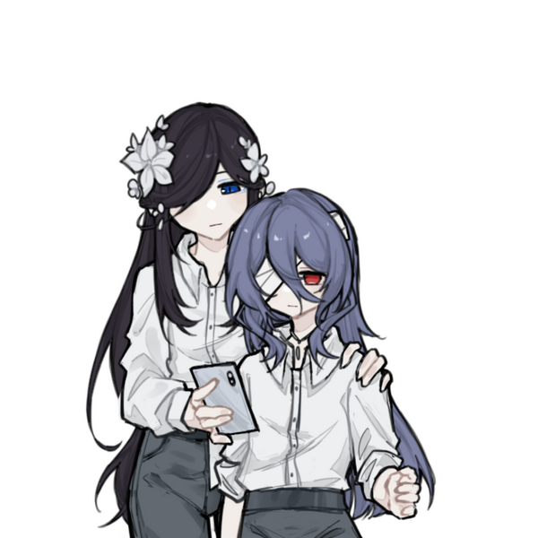
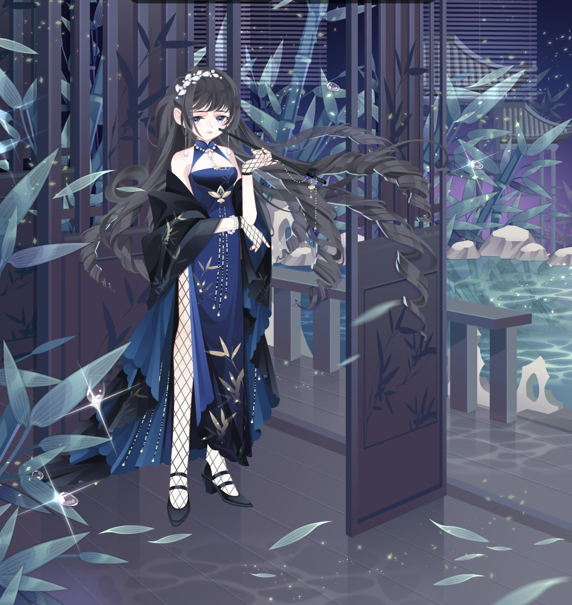
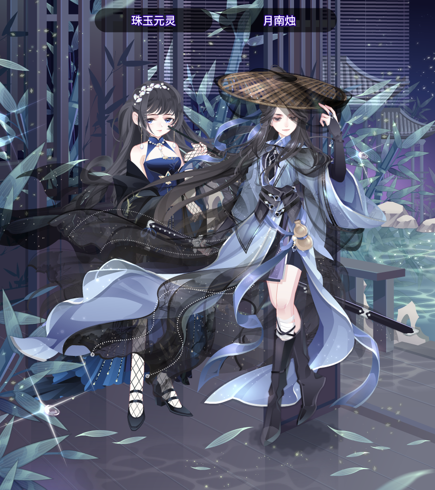

## 目录
[[toc]]

## 与你七年后的相遇

### 墟雾
800个小心眼子

墟雾（是家姓，名暂且不清楚）小时候大家都称呼她雾江

父母是普通上班族，祖辈曾经是咒术师，后来隐退了

能力是制造+操纵竹叶，竹叶边缘可调节锋利程度

小时候打扮的跟男孩子几乎一模一样，本性终极乐子人，只要不会引火上身，她特别喜欢看戏

对吃瓜超级感兴趣，对于在意的人有种超乎常态的保护欲

小时候短发，长大后留了长发，执行任务的时候经常会扎马尾（防止风吹糊脸）

小时候与狗卷棘认识，住对门，两人玩的很来，墟雾特别喜欢逗狗卷棘玩（然后就浪翻车）

平常与狗卷棘的交流是墟雾讲话，他写字（当然经常墟雾会抢走纸笔要求狗卷棘开口讲话）

喜欢狗卷棘的眼睛（他是为数不多不会把墟雾当异类来看的人）

“它很温柔，也有点胆小，大概是因此，你很向往那股温柔，以及那个人。”

伴生灵：夙安华/破晓

回国后住在今谷臻开的杂货铺里，平日帮忙打工，没事就出门逛街，晚上会清扫咒灵

小时候遇到特殊原因需要搬家，急急忙忙的并没有与他交换联系方式，只是口头说她一定会回来的

父母因为意外死去，被家族里的人带回去培训，直到近几年才许可让女主出来一个人闯荡

期间一直都是夙安华陪在墟雾身边，墟雾的手机里存着与父母亲以及狗卷棘的合照，还有好多回忆（她将手机看的特别珍贵）

因为食言所以回到东京的这几年一直不知道该怎么面对狗卷棘

跟五条悟玩（？）的很来（？毕竟四舍五入都是乐子人）




### 夙安华
可以操纵雾

墟雾家族的伴生灵，在墟雾诞生的时候被唤醒，从此一直跟着墟雾，其因为一直跟着墟雾家族的世世代代，本人宛如人形百科

性格没有随着时间磨灭，是一个平常会开开玩笑，但关键时刻会保护墟雾的~~靠谱家长~~



### 破晓
与夙安华类似，但不同，没有强烈的自我意识

大多数情况下是剑的形态，随时可以被墟雾召唤

一般不会露真身，是墟雾家族的传家宝



### 今谷臻
杂货铺的拥有者，收留了回国无住处的女主

饭团+甜品十分受欢迎

比墟雾妈妈年轻，但总是带入妈妈辈的角色

## 旅行中捡到小骑士

### 薇莉丝
```
没写过
```

###	护符/法术
```
这个有内容但感觉适合挪的时候单独开一个
```

## 云
茶馆老板

坊间传闻给钱便能除去身上的疼痛，不过能持续多久跟交换的物品有关联（交易的货币不一定只是钱）传闻里还说那老板身体状况并不好

实际上是让交易对象喝特定的茶就可以疼痛转移，但是最长有效期基本上只有一年左右，前提是交易对象必须亲自来到茶馆里喝茶

*如果年效过了，交易对象还想续的话必须再次亲自来到茶馆